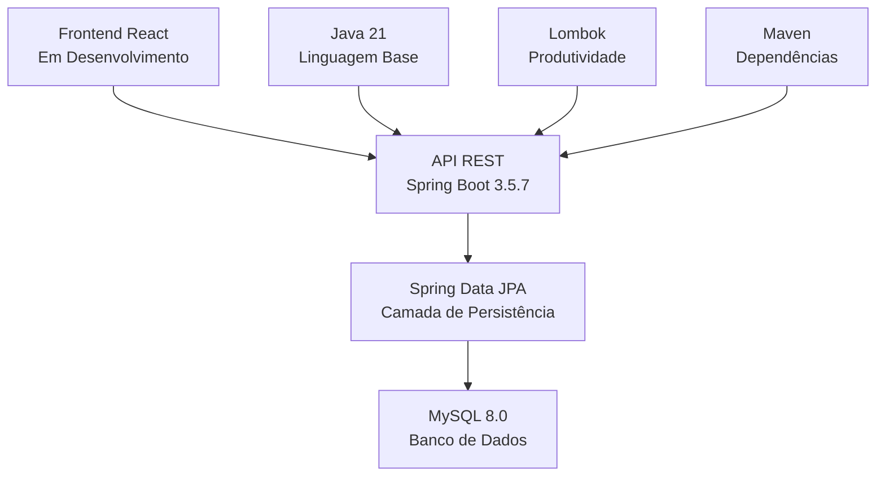

#  MotoApp API - Sistema de Gestão Financeira para Motoristas

## 📋 Sobre o Projeto
API RESTful desenvolvida em **Spring Boot** para gestão financeira e operacional de motoristas de aplicativo (Uber, 99, iFood, etc). O sistema permite registrar corridas, controlar gastos, calcular lucros automaticamente e gerar relatórios detalhados através de um dashboard completo.

**Objetivo:** Facilitar o controle financeiro de motoristas autônomos, fornecendo ferramentas profissionais para análise de rentabilidade e tomada de decisão.

# 🚀 Tecnologias Utilizadas

<div align="center">

## 🏗️ **Stack Tecnológica**

<div style="display: flex; flex-wrap: wrap; gap: 15px; justify-content: center; margin: 30px 0;">

<!-- Spring Boot Card -->
<div style="background: linear-gradient(135deg, #6DB33F 0%, #4A913C 100%); 
            border-radius: 10px; 
            padding: 20px; 
            width: 200px; 
            box-shadow: 0 4px 6px rgba(0,0,0,0.1);
            text-align: center;
            color: white;">
    <div style="font-size: 32px; margin-bottom: 10px;">🌱</div>
    <h3 style="margin: 10px 0; font-weight: bold;">Spring Boot</h3>
    <div style="background: rgba(255,255,255,0.2); 
                padding: 5px 10px; 
                border-radius: 20px; 
                display: inline-block;
                font-weight: bold;">3.5.7</div>
    <p style="margin-top: 10px; font-size: 14px; opacity: 0.9;">
        Framework principal para construção da API REST
    </p>
</div>

<!-- Java Card -->
<div style="background: linear-gradient(135deg, #ED8B00 0%, #D87C00 100%); 
            border-radius: 10px; 
            padding: 20px; 
            width: 200px; 
            box-shadow: 0 4px 6px rgba(0,0,0,0.1);
            text-align: center;
            color: white;">
    <div style="font-size: 32px; margin-bottom: 10px;">☕</div>
    <h3 style="margin: 10px 0; font-weight: bold;">Java</h3>
    <div style="background: rgba(255,255,255,0.2); 
                padding: 5px 10px; 
                border-radius: 20px; 
                display: inline-block;
                font-weight: bold;">21</div>
    <p style="margin-top: 10px; font-size: 14px; opacity: 0.9;">
        Linguagem principal com LTS para performance
    </p>
</div>

<!-- MySQL Card -->
<div style="background: linear-gradient(135deg, #4479A1 0%, #2C5F8A 100%); 
            border-radius: 10px; 
            padding: 20px; 
            width: 200px; 
            box-shadow: 0 4px 6px rgba(0,0,0,0.1);
            text-align: center;
            color: white;">
    <div style="font-size: 32px; margin-bottom: 10px;">🐬</div>
    <h3 style="margin: 10px 0; font-weight: bold;">MySQL</h3>
    <div style="background: rgba(255,255,255,0.2); 
                padding: 5px 10px; 
                border-radius: 20px; 
                display: inline-block;
                font-weight: bold;">8.0</div>
    <p style="margin-top: 10px; font-size: 14px; opacity: 0.9;">
        Banco relacional com UUID BINARY(16)
    </p>
</div>

<!-- Spring Data JPA Card -->
<div style="background: linear-gradient(135deg, #6DB33F 0%, #4A913C 100%); 
            border-radius: 10px; 
            padding: 20px; 
            width: 200px; 
            box-shadow: 0 4px 6px rgba(0,0,0,0.1);
            text-align: center;
            color: white;">
    <div style="font-size: 32px; margin-bottom: 10px;">🗄️</div>
    <h3 style="margin: 10px 0; font-weight: bold;">Spring Data JPA</h3>
    <div style="background: rgba(255,255,255,0.2); 
                padding: 5px 10px; 
                border-radius: 20px; 
                display: inline-block;
                font-weight: bold;">3.5.7</div>
    <p style="margin-top: 10px; font-size: 14px; opacity: 0.9;">
        Persistência de dados com Hibernate
    </p>
</div>

</div>

## 🔧 **Tecnologias Adicionais**

<div style="display: flex; flex-wrap: wrap; gap: 15px; justify-content: center; margin: 30px 0;">

<!-- Lombok Card -->
<div style="background: linear-gradient(135deg, #4B2C5F 0%, #3A1E4A 100%); 
            border-radius: 10px; 
            padding: 15px; 
            width: 180px; 
            box-shadow: 0 3px 5px rgba(0,0,0,0.1);
            text-align: center;
            color: white;">
    <div style="font-size: 24px; margin-bottom: 8px;">⚡</div>
    <h4 style="margin: 8px 0; font-weight: bold;">Lombok</h4>
    <p style="margin-top: 5px; font-size: 12px; opacity: 0.9;">
        Redução de boilerplate
    </p>
</div>

<!-- Maven Card -->
<div style="background: linear-gradient(135deg, #C71A36 0%, #A5152B 100%); 
            border-radius: 10px; 
            padding: 15px; 
            width: 180px; 
            box-shadow: 0 3px 5px rgba(0,0,0,0.1);
            text-align: center;
            color: white;">
    <div style="font-size: 24px; margin-bottom: 8px;">📦</div>
    <h4 style="margin: 8px 0; font-weight: bold;">Maven</h4>
    <p style="margin-top: 5px; font-size: 12px; opacity: 0.9;">
        Gerenciamento de dependências
    </p>
</div>

<!-- Jakarta Card -->
<div style="background: linear-gradient(135deg, #4A6FA5 0%, #3A5985 100%); 
            border-radius: 10px; 
            padding: 15px; 
            width: 180px; 
            box-shadow: 0 3px 5px rgba(0,0,0,0.1);
            text-align: center;
            color: white;">
    <div style="font-size: 24px; margin-bottom: 8px;">🔌</div>
    <h4 style="margin: 8px 0; font-weight: bold;">Jakarta EE</h4>
    <p style="margin-top: 5px; font-size: 12px; opacity: 0.9;">
        APIs modernas de persistência
    </p>
</div>

<!-- Git Card -->
<div style="background: linear-gradient(135deg, #F05032 0%, #D14028 100%); 
            border-radius: 10px; 
            padding: 15px; 
            width: 180px; 
            box-shadow: 0 3px 5px rgba(0,0,0,0.1);
            text-align: center;
            color: white;">
    <div style="font-size: 24px; margin-bottom: 8px;">📁</div>
    <h4 style="margin: 8px 0; font-weight: bold;">Git</h4>
    <p style="margin-top: 5px; font-size: 12px; opacity: 0.9;">
        Controle de versão
    </p>
</div>

</div>

</div>

## 🏗️ **Arquitetura Tecnológica**



## 📊 **Vantagens da Stack Escolhida**

| Tecnologia | Benefício | Uso no Projeto |
|------------|-----------|----------------|
| **Spring Boot 3.5.7** | Configuração rápida, embarcado Tomcat | API REST com autoconfiguração |
| **Java 21** | Performance, LTS, recursos modernos | Lógica de negócio e cálculos |
| **MySQL 8.0** | Confiabilidade, performance, JSON | Armazenamento UUID BINARY(16) |
| **Spring Data JPA** | Abstração de persistência, queries otimizadas | CRUD automático das entidades |

---

<div align="center" style="margin-top: 40px; padding: 20px; background: #f5f5f5; border-radius: 10px;">
    <h3>🚀 Stack Atualizada e Produtiva</h3>
    <p>Combinação moderna de tecnologias estabelecidas para desenvolvimento ágil e performance garantida</p>
</div>
## 📊 Modelo de Dados

### 🧑‍💼 **Usuario**
```java
@Id UUID usuarioId     // Identificador único
String nome            // Nome completo
String email           // Email (único)
String senha           // Hash bcrypt
```

### 📝 **Registro** (Corrida/Turno)
```java
@Id UUID registroId    // ID do registro
@ManyToOne Usuario usuario  // Motorista

// Informações básicas
LocalDate data
String plataforma      // Uber, 99, iFood, etc
String plataformaOutro // Se escolher "Outro"

// Métricas
int horasTrabalhadas
int corridasRealizadas
BigDecimal valorBruto

// Quilometragem
int kmInicial
int kmFinal            // Calcula kmRodados automaticamente

// Despesas
BigDecimal combustivel
BigDecimal alimentacao
BigDecimal gastosAdicionais

// Informações
String observacao
BigDecimal lucro       // Calculado automaticamente

// Método calculado
public int getKmRodados() {
    return kmFinal - kmInicial;
}
```

## 🔗 Endpoints da API

### 🔐 Autenticação
| Método | Endpoint | Descrição | Body |
|--------|----------|-----------|------|
| `POST` | `/usuarios/login` | Login de usuário | `{email, senha}` |
| `POST` | `/usuarios/post` | Criar novo usuário | `{nome, email, senha}` |

### 👤 Usuários
| Método | Endpoint | Descrição |
|--------|----------|-----------|
| `GET` | `/usuarios/{id}` | Buscar usuário por ID |
| `GET` | `/usuarios/TODOS` | Listar todos usuários |
| `PUT` | `/usuarios/alter/{id}` | Atualizar usuário |
| `DELETE` | `/usuarios/delete/{id}` | Deletar usuário |

### 📝 Registros (Corridas)
| Método | Endpoint | Descrição | Body |
|--------|----------|-----------|------|
| `POST` | `/registros/{usuarioId}` | Criar novo registro | `Registro completo` |
| `GET` | `/registros/todos/{usuarioId}` | Listar registros do usuário | - |
| `GET` | `/registros` | Listar todos registros | - |
| `PUT` | `/registros/alter/{registroId}` | Atualizar registro | `Campos para atualizar` |
| `DELETE` | `/registros/delete/{registroId}` | Deletar registro | - |

### 📊 Dashboard & Análises
| Método | Endpoint | Descrição | Parâmetros |
|--------|----------|-----------|------------|
| `GET` | `/dashboard/estatisticas/{usuarioId}` | Cards com estatísticas | - |
| `GET` | `/dashboard/corridas-por-dia/{usuarioId}` | Gráfico de corridas por dia | `inicio, fim` (YYYY-MM-DD) |
| `GET` | `/dashboard/lucro-gastos/{usuarioId}` | Gráfico lucro vs gastos | `inicio, fim` (YYYY-MM-DD) |
| `GET` | `/dashboard/plataformas/{usuarioId}` | Estatísticas por plataforma | - |
| `GET` | `/dashboard/ultimos-registros/{usuarioId}` | Últimos registros | `limite` (opcional, padrão: 5) |

## 🧮 Cálculos Automáticos

### 💰 **Lucro**
```java
lucro = valorBruto - (combustivel + alimentacao + gastosAdicionais)
```
*Calculado automaticamente antes de salvar via `@PrePersist` e `@PreUpdate`*

### 🛣️ **Km Rodados**
```java
kmRodados = kmFinal - kmInicial
```
*Calculado sob demanda via método getter `getKmRodados()`*

## 📊 Exemplos de Uso

### 📝 Criar um Registro
**URL:** `POST http://localhost:8080/registros/{usuarioId}`

```json
{
  "data": "2024-01-15",
  "plataforma": "Uber",
  "horasTrabalhadas": 8,
  "corridasRealizadas": 12,
  "valorBruto": 250.00,
  "kmInicial": 10000,
  "kmFinal": 10120,
  "combustivel": 40.00,
  "alimentacao": 20.00,
  "gastosAdicionais": 10.00,
  "observacao": "Turno da manhã"
}
```

**Resposta:**
```json
{
  "registroId": "a1b2c3d4-e5f6-7890-abcd-ef1234567890",
  "data": "2024-01-15",
  "plataforma": "Uber",
  "horasTrabalhadas": 8,
  "corridasRealizadas": 12,
  "valorBruto": 250.00,
  "kmInicial": 10000,
  "kmFinal": 10120,
  "combustivel": 40.00,
  "alimentacao": 20.00,
  "gastosAdicionais": 10.00,
  "observacao": "Turno da manhã",
  "lucro": 180.00,
  "kmRodados": 120
}
```

### 📊 Dashboard Estatísticas
**URL:** `GET http://localhost:8080/dashboard/estatisticas/{usuarioId}`

**Resposta:**
```json
{
  "totalCorridas": 32,
  "lucroTotal": "R$800.00",
  "gastosTotais": "R$122.00",
  "kmRodados": "142 km"
}
```

### 📅 Corridas por Dia
**URL:** `GET http://localhost:8080/dashboard/corridas-por-dia/{usuarioId}?inicio=2024-01-01&fim=2024-01-31`

**Resposta:**
```json
[
  {
    "data": "2024-01-15",
    "corridas": 12,
    "plataforma": "Uber"
  },
  {
    "data": "2024-01-16",
    "corridas": 8,
    "plataforma": "99"
  }
]
```

## ⚙️ Configuração

### 1. Pré-requisitos
- Java 17 ou superior
- MySQL 8.0+
- Maven 3.8+

### 2. Banco de Dados
```sql
CREATE DATABASE motoapp;
USE motoapp;

CREATE TABLE usuario (
    usuario_id BINARY(16) PRIMARY KEY,
    nome VARCHAR(255) NOT NULL,
    email VARCHAR(255) UNIQUE NOT NULL,
    senha VARCHAR(255) NOT NULL
);

CREATE TABLE registro (
    registro_id BINARY(16) PRIMARY KEY,
    data DATE NOT NULL,
    plataforma VARCHAR(255) NOT NULL,
    plataforma_outro VARCHAR(255),
    horas_trabalhadas INT,
    corridas_realizadas INT,
    valor_bruto DECIMAL(10,2),
    km_inicial INT,
    km_final INT,
    combustivel DECIMAL(10,2),
    alimentacao DECIMAL(10,2),
    gastos_adicionais DECIMAL(10,2),
    observacao TEXT,
    lucro DECIMAL(10,2) NOT NULL,
    usuario_id BINARY(16) NOT NULL,
    FOREIGN KEY (usuario_id) REFERENCES usuario(usuario_id) ON DELETE CASCADE
);
```

### 3. Configuração da Aplicação
**Crie o arquivo `src/main/resources/application.yml`:**
```yaml
spring:
  datasource:
    url: jdbc:mysql://localhost:3306/motoapp
    username: seu_usuario
    password: sua_senha
    driver-class-name: com.mysql.cj.jdbc.Driver
  
  jpa:
    hibernate:
      ddl-auto: update
    show-sql: true
    properties:
      hibernate:
        format_sql: true
        dialect: org.hibernate.dialect.MySQLDialect

server:
  port: 8080

logging:
  level:
    org.hibernate.SQL: DEBUG
    org.springframework.web: INFO
```

### 4. Execução
```bash
# Clone o repositório
git clone https://github.com/felipeburidev/MotoAppAPI.git
cd MotoAppAPI

# Compile e execute
mvn clean package
java -jar target/MotoAppApi-0.0.1-SNAPSHOT.jar

# Ou execute diretamente
mvn spring-boot:run
```

## 📁 Estrutura do Projeto
```
MotoAppAPI/
├── src/main/java/MOTOAPPAPI/MotoAppApi/
│   ├── controller/          # Controladores REST
│   │   ├── UsuarioController.java
│   │   ├── RegistroController.java
│   │   └── DashboardController.java
│   ├── model/              # Entidades JPA
│   │   ├── Usuario.java
│   │   └── Registro.java
│   ├── repository/         # Interfaces Spring Data JPA
│   │   ├── UsuarioRepository.java
│   │   └── RegistroRepository.java
│   ├── service/           # Lógica de negócio
│   │   ├── UsuarioService.java
│   │   └── RegistroService.java
│   └── MotoAppApiApplication.java
├── src/main/resources/
│   ├── application.yml.example  # Template de configuração
│   └── application.yml          # Configuração local (não versionado)
├── pom.xml                     # Dependências Maven
└── README.md                  # Documentação
```

## 🔧 Funcionalidades Técnicas

### 🛡️ Segurança
- Hash de senhas com BCrypt
- Validação de email único
- Proteção contra injeção SQL
- .gitignore configurado para proteger credenciais

### ⚡ Performance
- UUID armazenado como BINARY(16) no MySQL
- Consultas otimizadas com índices
- Cálculos realizados no banco quando possível

### 🚨 Tratamento de Erros
- Mensagens de erro claras em português
- Códigos HTTP apropriados (200, 400, 404, 500)
- Validação de dados em tempo real

## 🌐 Frontend em Desenvolvimento
Um frontend responsivo está sendo desenvolvido para complementar esta API, proporcionando uma interface intuitiva para motoristas gerenciarem suas finanças.

## 🤝 Contribuição
1. Fork o projeto
2. Crie uma branch para sua feature (`git checkout -b feature/nova-funcionalidade`)
3. Commit suas mudanças (`git commit -m 'Adiciona nova funcionalidade'`)
4. Push para a branch (`git push origin feature/nova-funcionalidade`)
5. Abra um Pull Request


## 👨‍💻 Autor
**Felipe Buri** - [@felipeburidev](https://github.com/felipeburidev)

## 🙏 Agradecimentos
- Equipe Spring pelo framework incrível
- Comunidade Java brasileira
- Todos os motoristas que testaram e deram feedback

---
✨ *"Organizando a vida financeira de motoristas, uma corrida por vez!"* ✨
